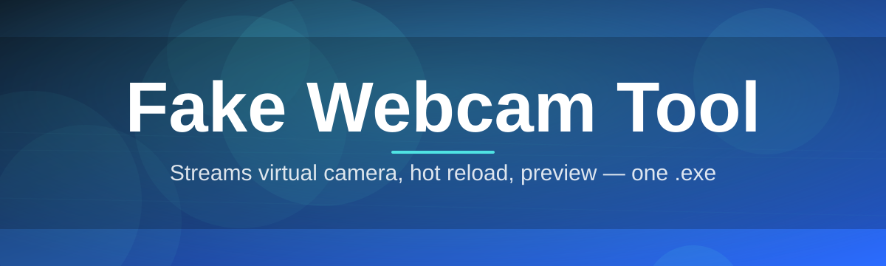
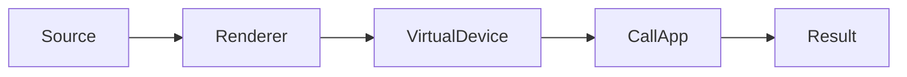

# webcam-mod-configurator 🎭📷

  

*Turn any video, image, or scene into a live virtual camera feed — no studio, no green screen, no fuss.*

  

One weekend project turned into the webcam configurator I always wished existed, and now it's yours too.

<strong>📖 The full story — click to expand</strong>

 

I built **webcam-mod-configurator** because every existing "virtual camera" utility I tried in 2025 was either bloated with telemetry, locked behind a subscription, or so poorly documented that configuring a simple video loop felt like defusing a bomb. As an indie developer who spends way too much time in video calls, I wanted a tool that was fast, transparent, and actually *fun* to configure.

What started as a weekend script to loop an MP4 into my meeting software slowly grew into a full configurator: scene layering, resolution matching, virtual device registration, live preview, hotkey switching — the works. I kept adding features because I kept finding new annoyances in my own workflow, and eventually realized other people probably had the exact same annoyances.

This repository is the result of months of iteration, dozens of Windows driver quirks solved, and a genuine love for building tools that respect the user's time. It's a passion project first, a piece of software second, and I'm proud of both.

---

## 🌐 Overview

**TL;DR:** A standalone Windows configurator that projects video, images, or animated scenes into a virtual webcam device — built for streamers, remote workers, and anyone who wants control over what their camera "sees."

**webcam-mod-configurator** is a fake webcam tool designed to sit between your real hardware and whatever application expects a webcam feed. Instead of exposing your literal camera sensor, it creates a virtual video device that plays back a source you choose — a pre-recorded clip, a static image, a looping scene, or a composited layer stack — and feeds that into video call software, streaming platforms, or recording tools exactly as if it were a physical camera.

The project exists because webcam substitution shouldn't require a computer science degree. Content creators use it to maintain a consistent on-camera look without being physically present. Remote employees use it to join back-to-back meetings without setting up lighting every single time. Streamers use it to swap between scenes on the fly, and developers use it to test camera-dependent applications without needing an actual camera plugged in. Whatever the use case, the goal is the same: full creative and practical control over your virtual camera output, wrapped in an interface that respects your time.

Unlike bulkier alternatives, this configurator has zero external dependencies, no background services phoning home, and no confusing settings buried six menus deep. It's a self-contained Windows application — download it, run it, configure your feed, go live. That's the whole pitch.

> [!NOTE]
> The landing page above always serves the current stable build. There is no separate "beta" channel to hunt for — what you see is what you get.

---

## 🎬 What It Actually Does

**TL;DR:** Nine capabilities that turn a static video source into a controllable, production-ready virtual camera feed.

- **Scene-based feed switching** — load multiple video or image sources as named "scenes" and swap between them instantly, without restarting the virtual device or interrupting your call.

- **Virtual device registration** — the configurator registers a standalone virtual camera at the OS level, so any application that lists webcams will see it as a normal, selectable device.

- **Resolution & framerate matching** — automatically detects what your target application expects and rescales your source feed to match, avoiding the stretched or letterboxed look common in cheaper alternatives.

- **Live preview panel** — see exactly what your virtual camera is outputting before you ever open your call software, so there are no surprise first impressions.

- **Loop & transition engine** — smooth crossfades and seamless looping keep your feed looking intentional rather than obviously looped.

- **Hotkey-driven scene control** — bind global shortcuts to swap scenes, mute the feed, or drop back to your real camera in under a second.

- **Layer compositing** — stack an image overlay, a video base layer, and a status indicator together without needing a separate editing tool.

- **Profile save/load** — store an entire configuration (sources, hotkeys, resolution, theme) as a profile and reload it in one click for different contexts (work calls vs. streaming).

- **Offline-first design** — no account, no cloud sync requirement, no telemetry dashboard watching your usage. Your feed configuration lives on your machine.

> [!TIP]
> Set up a "neutral" scene as your default and bind it to a hotkey you can hit blind. It's the fastest way to look composed when a call starts earlier than expected.

---

## 🚀 How to Get Started

**TL;DR:** Visit the landing page, download the executable, run it, load a source — you're live in under two minutes.

1. **Visit the landing page** using the download button on this page — it always points to the current release.

2. **Download the standalone executable.** There's nothing to extract, no installer wizard with bundled offers — just one file.

3. **Run the application.** Windows may show a SmartScreen prompt for unsigned software on first launch; this is expected for indie-built tools and is covered in the troubleshooting section below.

4. **Load a source, register the virtual device, and select it inside your call or streaming software** exactly like you'd select a physical webcam.

> [!IMPORTANT]
> Run the configurator *before* opening your video call software. The virtual device needs to be registered first so your call app can detect it in its camera list.

---

## 🖥️ System Requirements

**TL;DR:** Windows 10 or 11, no installed dependencies, minimal footprint.

| Requirement | Detail |
|---|---|
| **OS** | Windows 10 (64-bit) or Windows 11 |
| **Architecture** | x64 |
| **Disk space** | Under 200 MB |
| **RAM** | 4 GB minimum, 8 GB recommended for large video sources |
| **Dependencies** | None — fully standalone, no runtime installs required |
| **Admin rights** | Required once, for virtual device registration |

  

---

## ⚙️ How It Works

**TL;DR:** Your source feeds into a rendering engine, which pipes frames into a registered virtual device that any application can read like a normal camera.

The configurator works in five stages:

1. **Source selection** — you pick a video, image, or composited scene as your feed origin.
2. **Rendering pipeline** — frames are decoded, scaled, and composited in real time.
3. **Virtual device registration** — the app registers a system-level virtual camera driver interface.
4. **Frame delivery** — rendered frames are pushed continuously into the virtual device buffer.
5. **Application consumption** — your call, stream, or recording software reads the virtual device exactly like a physical webcam.

> [!NOTE]
> The virtual device persists only while the configurator is running. Closing the app cleanly unregisters it — nothing lingers in your device list afterward.

---

## 🧩 Troubleshooting

**TL;DR:** Most issues are driver registration timing or app-detection order — both fixable in under a minute.

<strong>My call software doesn't show the virtual camera in its device list</strong>

 

Make sure the configurator was running *before* you opened the call software, and that the virtual device was successfully registered (check the status indicator in the app's title bar). Restart the call app's camera selector menu if it was already open.

<strong>Windows SmartScreen flagged the executable</strong>

 

This is standard for unsigned indie software and doesn't indicate anything malicious. Click "More info" then "Run anyway." Signing is on the roadmap once the project reaches a broader distribution stage.

<strong>My video source looks stretched or cropped</strong>

 

Enable automatic resolution matching in Settings → Output, and confirm your source's native aspect ratio matches your target call app's expected resolution.

<strong>The feed freezes on the first frame</strong>

 

This usually means the source file is still decoding on a slower disk. Switch to a local drive rather than a network share, or pre-cache the source using the "Preload" toggle in the source panel.

<strong>Hotkeys aren't responding</strong>

 

Global hotkeys require the configurator window to have background focus permissions. Check Settings → Shortcuts and re-bind the key combination if another application has claimed it.

---

## 🎨 UI / UX Details

**TL;DR:** A dark-first interface with full keyboard control, theme switching, and per-profile settings persistence.

- **Themes:** Midnight (default), Slate, and High-Contrast — switchable instantly from the title bar.

- **Keyboard shortcuts:**

| Action | Shortcut |
|---|---|
| Toggle live preview | `Ctrl + P` |
| Switch to next scene | `Ctrl + →` |
| Switch to previous scene | `Ctrl + ←` |
| Emergency real-camera fallback | `Ctrl + Shift + R` |
| Mute feed (black frame) | `Ctrl + M` |
| Open settings | `Ctrl + ,` |

- **Settings persistence:** every profile stores resolution targets, hotkey bindings, theme choice, and source list — reload it instantly from the profile dropdown.

> [!TIP]
> Use High-Contrast theme when configuring scenes on a projector or secondary display — it keeps the layer boundaries visible even in bright rooms.

---

## 🤝 Contributing & Community

**TL;DR:** Issues, pull requests, and feature discussions are welcome — this project grows through real user feedback.

> Built by one developer, improved by everyone who's opened an issue with a screenshot and a clear repro.

If you'd like to contribute:

- Open an issue describing the bug or feature with as much detail as possible.
- Fork the repository and submit a pull request against the `main` branch.
- Keep changes scoped — smaller, focused PRs get reviewed faster.
- Join discussions on existing issues before starting large refactors, to avoid duplicate work.

Every bit of community feedback has directly shaped a feature in this tool — scene transitions, the profile system, and the High-Contrast theme all started as issue reports.

---

## 📜 License

**TL;DR:** MIT licensed, 2026 — use it, modify it, ship it, just keep the license notice.

This project is released under the [MIT License](LICENSE). You're free to use, modify, and distribute it